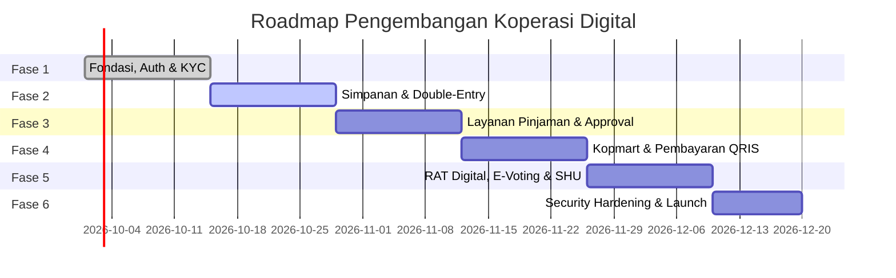

# Aturan Pengembangan: Rencana Pengembangan (*Development Plan*)

Dokumen ini memetakan tahapan rilis (*milestones*), pembagian sprint, dan alur kerja kolaborasi Git untuk membangun ekosistem Koperasi Digital secara terukur dan berkualitas tinggi.

---

## 1. Roadmap Tahapan Rilis (*Sprint Milestones*)

### Sprint 1: Fondasi Sistem, Autentikasi & KYC
* Setup arsitektur backend Laravel 13 dan struktur modular Flutter.
* Pembuatan tabel migrasi database inti (users, members, member_kyc).
* Endpoint registrasi anggota, verifikasi NIK, unggah foto KTP ke MinIO/S3.
* Tampilan Flutter: Auth, Registrasi, dan Layanan KYC Pending.

### Sprint 2: Manajemen Simpanan & Mesin Akuntansi Berpasangan
* Implementasi akun simpanan: Pokok, Wajib, dan Sukarela.
* Pembangunan *Double-Entry Journal Engine* (Buku besar otomatis untuk setiap mutasi saldo).
* Top-up simpanan via Virtual Account dan simulasi penarikan saldo sukarela.
* Tampilan Flutter: Layanan Manajemen Simpanan (`design/manajemen_simpanan`).

### Sprint 3: Layanan Pinjaman & Multi-Tier Approval
* Kalkulator simulasi bunga pinjaman (Metode Flat & Menurun/Sliding).
* Alur pengajuan pinjaman dengan validasi plafon (maksimal $n \times$ simpanan).
* Panel persetujuan berjenjang untuk Pengurus & Bendahara.
* Jadwal angsuran otomatis dan mekanisme pemotongan saldo bulanan.
* Tampilan Flutter: Layanan Pinjaman (`design/layanan_pinjaman`).

### Sprint 4: Kopmart & Pembayaran QRIS
* Katalog barang belanja karyawan dan integrasi keranjang belanja.
* Transaksi belanja potong saldo simpanan sukarela atau kasbon.
* Modul pemindaian dan generate QRIS dinamis/statis.
* Tampilan Flutter: Kopmart, Bayar QRIS, Konfirmasi, dan Bukti Pembayaran (`design/*qris*`).

### Sprint 5: RAT Digital, E-Voting & Distribusi SHU
* Modul Rapat Anggota Tahunan digital dengan verifikasi kuorum kehadiran.
* Pengunduhan dokumen LPJ Pengurus & Pengawas terenkripsi.
* Pemungutan suara elektronik (E-Voting) dengan grafik hasil *real-time*.
* Mesin kalkulasi SHU akhir tahun (Jasa Modal & Jasa Usaha) dan distribusi dividen.

### Sprint 6: Audit Keamanan, Optimasi Performa & Rilis Produksi
* Pengujian penetrasi (*penetration test*) dan audit celah finansial.
* Optimasi kueri PostgreSQL dan konfigurasi caching Redis.
* Build rilis aplikasi Android (.aab / APK) dan iOS (TestFlight / App Store).

---

## 2. Strategi Percabangan Git (*Branching Model*)

* **`main`**: Kode produksi stabil yang telah melalui tahap pengujian menyeluruh.
* **`develop`**: Cabang integrasi aktif tempat menggabungkan fitur-fitur baru.
* **`feature/<nama-fitur>`**: Cabang pengembangan spesifik (e.g., `feature/loan-calculator`, `feature/qris-scanner`).
* **`hotfix/<isu>`**: Perbaikan darurat langsung terhadap bug di `main`.

---

## 3. Kriteria Penerimaan Pull Request (*PR Checklist*)
Sebelum sebuah Pull Request dapat di-merge ke branch `develop`:
1. Semua pengujian otomatis (Pest PHP & Flutter Test) berstatus **LULUS** (100%).
2. Tidak ada pelanggaran linter (`vendor/bin/pint` dan `flutter analyze`).
3. Seluruh perubahan skema database menyertakan file migrasi yang kompatibel.
4. Minimal disetujui oleh 1 *Senior Engineer* (dan verifikasi khusus untuk logika pembukuan).
