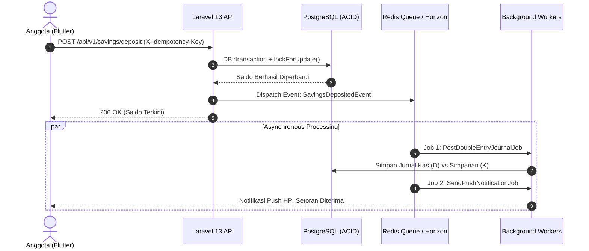

# Aturan Pengembangan: Mesin Transaksi & Pemrosesan Antrian (*Dispatch Engine*)

Dokumen ini merumuskan arsitektur pengolahan transaksi finansial berbasis *Event-Driven* dan *Queue Dispatcher* pada backend Laravel 13 menggunakan Redis dan Laravel Horizon.

---

## 1. Arsitektur Pemrosesan Transaksi (*Event-Driven Architecture*)

Operasi finansial dibagi menjadi dua fase:
1. **Fase Sinkron (Atomik di Database)**:
   * Validasi saldo dan aturan bisnis.
   * Penguncian baris (*pessimistic lock*).
   * Pembaruan saldo rekening anggota.
   * Pembuatan rekam jejak transaksi awal.
   * Pemicuan Event (*Triggering Event*).
2. **Fase Asinkron (Antrian Antar Layanan via Worker)**:
   * Posting buku besar akuntansi berpasangan (*Double-Entry Journal Posting*).
   * Pengiriman notifikasi push ke aplikasi Flutter anggota (FCM).
   * Pembuatan kuitansi digital (*PDF receipt*).
   * Pembaruan laporan analitik real-time pengurus.



---

## 2. Struktur Job & Event Transaksi

### 1. Definisi Event Finansial
```php
declare(strict_types=1);

namespace App\Events\Savings;

use App\Models\Transaction;
use Illuminate\Broadcasting\InteractsWithSockets;
use Illuminate\Foundation\Events\Dispatchable;
use Illuminate\Queue\SerializesModels;

final class SavingsDepositedEvent
{
    use Dispatchable, InteractsWithSockets, SerializesModels;

    public function __construct(
        public readonly Transaction $transaction
    ) {}
}
```

### 2. Listener Jurnal Pembukuan Berpasangan (Queueable)
```php
declare(strict_types=1);

namespace App\Listeners\Accounting;

use App\Events\Savings\SavingsDepositedEvent;
use App\Services\Accounting\JournalPostingService;
use Illuminate\Contracts\Queue\ShouldQueue;
use Illuminate\Queue\InteractsWithQueue;

class PostSavingsJournalListener implements ShouldQueue
{
    use InteractsWithQueue;

    public string $queue = 'financial-ledger';
    public int $tries = 5;
    public int $backoff = 10;

    public function __construct(
        private JournalPostingService $journalService
    ) {}

    public function handle(SavingsDepositedEvent $event): void
    {
        // Otomatis membuat Debit Kas/Bank dan Kredit Liabilitas Simpanan
        $this->journalService->recordSavingsDeposit($event->transaction);
    }
}
```

---

## 3. Prioritas Antrian (*Queue Priorities in Horizon*)

Antrian diatur berdasarkan tingkat urgensi:
1. **`high-financial`**: Transaksi pembayaran QRIS, debet instan, dan verifikasi OTP.
2. **`financial-ledger`**: Posting pembukuan jurnal akuntansi berpasangan.
3. **`notifications`**: Pengiriman notifikasi push mobile, email akad pinjaman, dan pesan WhatsApp.
4. **`reports`**: Ekspor berkas laporan keuangan tahunan dan pembagian SHU.

---

## 4. Penanganan Kegagalan (*Dead Letter Queue & Retries*)

* Setiap job finansial memiliki kebijakan pengulangan (*exponential backoff*): 5 detik, 15 detik, 30 detik.
* Jika sebuah job akuntansi gagal setelah batas percobaan maksimal:
  1. Job dipindahkan ke tabel `failed_jobs`.
  2. Sistem mengirimkan peringatan tingkat tinggi (*critical alert*) ke kanal pemantauan tim teknis (Telegram / Slack).
  3. Status transaksi ditandai `needs_reconciliation` untuk ditinjau oleh tim akuntansi koperasi.
