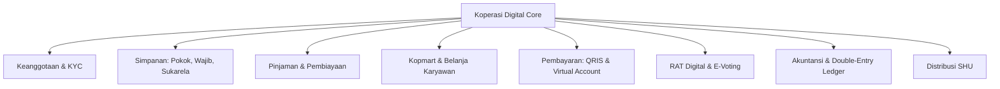

# Aturan Pengembangan: Overview Sistem Koperasi Digital

## 1. Filosofi & Visi Sistem
Sistem **Koperasi Digital** (*KopKar Digital*) adalah platform fintech perkoperasian modern yang dirancang untuk mendigitalkan seluruh ekosistem koperasi karyawan di Indonesia. Sistem ini memadukan nilai luhur perkoperasian (*kekeluargaan, gotong royong, transparansi*) dengan standar keandalan finansial enterprise perbankan (*keamanan data, auditabilitas mutlak, pembukuan berpasangan, transaksi real-time*).

Sistem mematuhi regulasi perundang-undangan perkoperasian Republik Indonesia:
* **UU No. 25 Tahun 1992** tentang Perkoperasian.
* **UU No. 4 Tahun 2023** tentang Pengembangan dan Penguatan Sektor Keuangan (UU P2SK).
* **Peraturan Menteri Koperasi dan UKM (Permenkop UKM)** terkait tata kelola simpan pinjam dan akuntabilitas koperasi.

---

## 2. Prinsip Arsitektural Utama (*Guiding Principles*)

1. **Integritas Finansial Mutlak (*Financial Integrity First*)**:
   * Setiap mutasi keuangan wajib dicatat menggunakan sistem buku besar berpasangan (*double-entry bookkeeping*). Total Debit harus selalu sama dengan total Kredit ($ \sum Debit = \sum Kredit $).
   * Nilai moneter tidak boleh menggunakan tipe data `float` atau `double`. Selalu gunakan `DECIMAL(15, 2)` di database dan representasi bilangan bulat/string terformat di aplikasi.
   * Setiap transaksi yang mempengaruhi saldo wajib berjalan dalam transaksi atomik database (`DB::transaction`) dan menggunakan *pessimistic row locking* (`lockForUpdate`).

2. **Pemisahan Tanggung Jawab & Kanal Akses (*Platform & Role Separation*)**:
   * **Superadmin & Pengurus (Kanal Web Laravel)**:
     * Menggunakan portal **Web Laravel** (akses browser desktop/laptop).
     * Fokus pada tata kelola backoffice: verifikasi KYC anggota, persetujuan pinjaman bertingkat, pembukuan jurnal buku besar berpasangan (*double-entry ledger*), manajemen produk Kopmart, rilis agenda RAT, penerbitan laporan keuangan (Neraca & Laba Rugi/SHU), dan manajemen peran/hak akses (*RBAC*).
   * **Anggota Koperasi (Kanal Mobile Flutter)**:
     * Menggunakan aplikasi **Mobile Flutter** (Android & iOS).
     * Fokus pada transaksi mandiri (*self-service*): pendaftaran & unggah KTP, pemantauan saldo simpanan (Pokok/Wajib/Sukarela), simulasi & pengajuan pinjaman, pembayaran cicilan, belanja di Kopmart, pemindaian bayar QRIS, e-voting RAT, dan proyeksi dividen SHU pribadi.
   * **Database & Integrasi Backend (PostgreSQL 16+ & Laravel 13 API)**:
     * Laravel 13 bertindak ganda: melayani rendering antarmuka Web Backoffice untuk Superadmin/Pengurus sekaligus menyediakan RESTful JSON API terlindungi (*Sanctum Tokens*) untuk aplikasi mobile Flutter Anggota.
     * PostgreSQL 16+ sebagai *single source of truth* menjamin kepatuhan ACID mutlak, integritas referensial relasional (*foreign keys, check constraints*), dan *indexing* optimal.

3. **Auditabilitas & Imutabilitas (*Immutable Audit Trails*)**:
   * Transaksi finansial yang telah diposting tidak boleh diubah (*UPDATE*) atau dihapus (*DELETE*). Koreksi transaksi hanya dapat dilakukan melalui mekanisme jurnal balik (*reversal / adjustment journal*).
   * Seluruh aktivitas sensitif (persetujuan pinjaman, perubahan status KYC, perubahan konfigurasi suku bunga, hak akses) wajib dicatat dalam tabel `audit_logs` secara permanen.

4. **Transparansi Demokratis (*Democratic Transparency*)**:
   * Sesuai asas koperasi *"One Member, One Vote"*, modul Rapat Anggota Tahunan (RAT) dan E-Voting menjamin bahwa satu akun anggota terverifikasi hanya memiliki satu hak suara yang sah dan terenkripsi di aplikasi mobile Flutter.
   * Pembagian Sisa Hasil Usaha (SHU) dihitung secara terbuka berdasarkan proporsi Jasa Modal (simpanan) dan Jasa Usaha/Anggota (transaksi riil di koperasi).

---

## 3. Aktor, Peran Sistem & Kanal Akses (*Roles & Access Channels*)

| Peran (*Role*) | Kanal Akses | Deskripsi & Hak Akses Utama |
| :--- | :---: | :--- |
| **Super Admin** | **Web Laravel** | Akses penuh portal web: Manajemen peran & izin (*RBAC*), konfigurasi suku bunga & plafon sistem, manajemen akun pengurus & anggota, integrasi payment gateway, monitoring audit log, backup & pemeliharaan server. |
| **Bendahara (*Treasurer*)** | **Web Laravel** | Portal web keuangan: Verifikasi pencairan pinjaman, kelola kas & bank, rekonsiliasi pembayaran, penyesuaian jurnal buku besar, approval penarikan saldo sukarela anggota. |
| **Ketua Pengurus (*Chairman*)**| **Web Laravel** | Portal web eksekutif: Persetujuan akhir pinjaman plafon tinggi, rilis agenda RAT & LPJ digital, penentuan kebijakan dividen SHU tahunan. |
| **Pengawas (*Auditor*)** | **Web Laravel** | Portal web audit (*read-only*): Pemeriksaan buku besar, neraca saldo, laporan laba rugi (SHU), kepatuhan rasio finansial, dan audit log mutlak. |
| **Operator Toko (*Kopmart Admin*)**| **Web Laravel** | Portal web ritel: Manajemen inventori & produk Kopmart, pemrosesan pesanan anggota, validasi voucher karyawan. |
| **Anggota (*Member*)** | **Mobile Flutter** | Aplikasi smartphone (Android/iOS): Login biometrik/PIN, verifikasi KYC KTP, pantau saldo simpanan, setor/tarik saldo sukarela, kalkulator & pengajuan pinjaman, bayar cicilan, belanja Kopmart, bayar QRIS, voting RAT, pantau estimasi SHU. |

---

## 4. Peta Modul Fungsional (*Core Domains*)

1. **Keanggotaan & KYC**: Registrasi terstruktur (NIK, NIP/Karyawan, No HP, KTP), verifikasi berkas, aktivasi simpanan pokok, penerbitan Nomor Anggota Koperasi (NAK).
2. **Manajemen Simpanan**:
   * *Simpanan Pokok*: Disetor sekali saat pendaftaran, syarat sah keanggotaan, tidak dapat ditarik selama menjadi anggota.
   * *Simpanan Wajib*: Disetor rutin bulanan (bisa via potong gaji otomatis / transfer manual), tidak dapat ditarik saat aktif.
   * *Simpanan Sukarela*: Fleksibel, dapat disetor dan ditarik kapan saja, bertindak sebagai dompet digital (*e-wallet*) anggota.
3. **Layanan Pinjaman**:
   * Simulasi pinjaman dinamis (bunga Flat & Sliding / Anuitas).
   * Validasi plafon pinjaman (maksimum $n \times$ total simpanan anggota).
   * Alur persetujuan bertingkat (*multi-tier approval*).
   * Jadwal angsuran otomatis dan pemotongan saldo / payroll cut.
4. **Kopmart & Belanja Karyawan**: Katalog kebutuhan harian, transaksi dengan saldo sukarela atau cicilan kasbon koperasi.
5. **QRIS & Payment Gateway**: Pembayaran belanja instan lewat QRIS (scan & show QR) serta top-up simpanan via Virtual Account multi-bank.
6. **RAT Digital & E-Voting**: Forum musyawarah tahunan daring, distribusi LPJ digital, pemungutan suara aman dan kuorum otomatis.
7. **Akuntansi Berpasangan**: Jurnal umum otomatis untuk setiap transaksi, neraca lajur, laporan laba rugi, dan neraca keuangan seimbang (*balanced balance sheet*).
8. **Kalkulasi & Pembagian SHU**: Perhitungan dividen otomatis pada akhir tahun buku untuk seluruh anggota secara proporsional.
