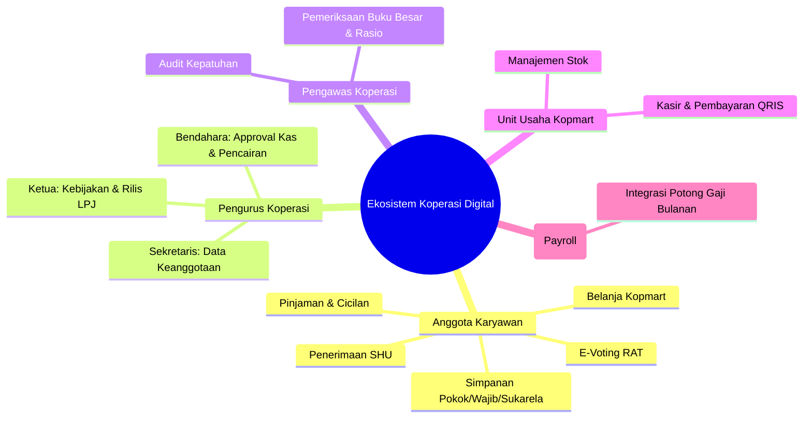
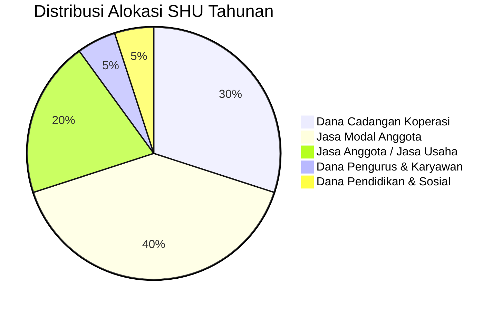

# Dokumen Kebutuhan Bisnis (BRD.md)
## Sistem Koperasi Digital (*KopKar Digital*)

* **Versi Dokumen**: 2.0.0
* **Tanggal Berlaku**: 14 September 2026
* **Status**: Disetujui (*Approved for Implementation*)
* **Domain**: Koperasi Simpan Pinjam & Unit Usaha Karyawan

---

## 1. Ringkasan Eksekutif (*Executive Summary*)
Koperasi Karyawan (*KopKar*) memegang peran strategis dalam menyejahterakan para pekerja melalui asas gotong royong dan kemandirian ekonomi. Namun, sistem operasional manual yang mengandalkan formulir kertas, pencatatan spreadsheet terisolasi, dan rekapitulasi manual menimbulkan berbagai permasalahan kritis:
1. **Ketidaktransparanan Saldo**: Anggota kesulitan mengetahui saldo simpanan dan sisa kewajiban pinjaman mereka secara *real-time*.
2. **Keterlambatan Penyaluran Pinjaman**: Proses pengajuan pinjaman memerlukan persetujuan fisik berhari-hari.
3. **Risiko Kesalahan Akuntansi**: Pembukuan yang tidak terintegrasi rentan terhadap ketidakseimbangan neraca dan potensi manipulasi data.
4. **Rendahnya Partisipasi RAT**: Keterbatasan ruang dan waktu fisik menyebabkan kehadiran Rapat Anggota Tahunan (RAT) sering kali tidak memenuhi syarat kuorum.

Platform **Koperasi Digital** mentransformasi seluruh siklus bisnis koperasi ke dalam ekosistem digital terpadu dengan arsitektur backend **Laravel 13**, aplikasi mobile **Flutter**, dan database **PostgreSQL**.

---

## 2. Landasan Regulasi & Kepatuhan Hukum

Sistem dirancang dengan mematuhi hierarki perundangan yang berlaku di Republik Indonesia:
* **UU No. 25 Tahun 1992 tentang Perkoperasian**: Menjamin asas kekeluargaan, keterbukaan keanggotaan, dan hak suara berlandaskan *"One Member, One Vote"*.
* **UU No. 4 Tahun 2023 tentang Pengembangan dan Penguatan Sektor Keuangan (UU P2SK)**: Menetapkan standar tata kelola risiko, akuntabilitas pelaporan, serta perlindungan dana anggota koperasi simpan pinjam (*closed loop*).
* **Peraturan Menteri Koperasi dan UKM RI No. 8 Tahun 2023**: Menetapkan ketentuan mengenai tata kelola usaha simpan pinjam oleh koperasi, batas maksimum pemberian pinjaman (BMPP), dan rasio kesehatan keuangan koperasi.
* **Standar Akuntansi Keuangan Entitas Privat (SAK EP)**: Pedoman baku untuk pencatatan buku besar berpasangan (*double-entry*) dan penyajian Laporan Keuangan Neraca serta Sisa Hasil Usaha (SHU).

---

## 3. Sasaran & Parameter Keberhasilan Bisnis (*Business KPIs*)

| Parameter Keberhasilan | Baseline Manual | Target Sistem Digital |
| :--- | :--- | :--- |
| **Waktu Persetujuan Pinjaman (*SLA*)** | 3 - 5 Hari Kerja | $< 4$ Jam (Otomasi Plafon) |
| **Partisipasi Kehadiran & Voting RAT** | 45% - 60% (Sering Gagal Kuorum) | $> 90\%$ (E-Voting Mobile) |
| **Akurasi & Integritas Buku Besar** | Rekonsiliasi bulanan manual | *Real-time Double-Entry* (100% Balanced) |
| **Tingkat Kredit Bermasalah (*NPL Ratio*)** | 3.5% | $< 1.0\%$ (Validasi Payroll Cut) |
| **Adopsi Anggota Aktif Mobile** | 0% | $> 85\%$ dalam 3 bulan pertama |

---

## 4. Analisis Pemangku Kepentingan (*Stakeholder Matrix*)

---

## 5. Aturan & Alur Proses Bisnis Inti (*Core Business Rules*)

### 5.1. Siklus Keanggotaan & KYC
1. **Syarat Pendaftaran**:
   * Karyawan berstatus aktif pada perusahaan terafiliasi.
   * Melampirkan identitas resmi (NIK 16 digit terverifikasi, nomor induk karyawan/NIP, dan foto KTP).
2. **Aktivasi Keanggotaan**:
   * Anggota baru berstatus `KYC_PENDING` hingga diverifikasi oleh sekretariat.
   * Keanggotaan dinyatakan **AKTIF** secara hukum setelah membayar penuh **Simpanan Pokok** yang telah ditentukan AD/ART (contoh: Rp 1.000.000).
   * Penerbitan Nomor Anggota Koperasi (NAK) berformat `KOP-YYYY-XXXXX`.
3. **Pengunduran Diri / Terminasi Keanggotaan**:
   * Anggota dapat mengundurkan diri jika tidak memiliki tunggakan pinjaman atau kewajiban yang belum diselesaikan.
   * Seluruh akumulasi Simpanan Pokok, Simpanan Wajib, dan Simpanan Sukarela dikembalikan utuh setelah dipotong biaya administrasi resmi melalui transfer bank.

---

### 5.2. Manajemen Simpanan (*Savings Framework*)

Koperasi mengelola 3 jenis simpanan dengan karakteristik berbeda:

| Karakteristik | Simpanan Pokok | Simpanan Wajib | Simpanan Sukarela |
| :--- | :--- | :--- | :--- |
| **Frekuensi Setor** | 1 Kali (Saat Masuk) | Rutin Setiap Bulan | Bebas / Kapan Saja |
| **Nominal** | Tetap (sesuai AD/ART) | Tetap (misal: Rp 100.000/bln)| Variabel (Min Rp 10.000) |
| **Penarikan Dana** | Tidak dapat ditarik | Tidak dapat ditarik | Fleksibel sewaktu-waktu |
| **Metode Setor** | Virtual Account / Transfer | Potong Gaji / VA | VA / QRIS / Potong Gaji |
| **Fungsi Finansial** | Modal Ekuitas Dasar | Pembentukan Modal Kerja | Dompet Likuiditas Anggota |
| **Kontribusi ke SHU**| Dihitung (Jasa Modal) | Dihitung (Jasa Modal) | Bunga/Bagi Hasil Simpanan |

---

### 5.3. Kebijakan & Pembiayaan Pinjaman (*Lending Framework*)

1. **Batas Maksimum Pemberian Pinjaman (Plafon)**:
   * **Aturan Plafon Multiplier**: Pinjaman maksimal tidak boleh melebihi $3 \times$ total simpanan (Pokok + Wajib + Sukarela) yang dimiliki anggota:
     $$\text{Plafon Maksimal} = 3 \times (\text{Simp. Pokok} + \text{Simp. Wajib} + \text{Simp. Sukarela})$$
   * **Aturan Debt Service Ratio (DSR)**: Total angsuran pinjaman bulanan tidak boleh melebihi $35\%$ dari total gaji bersih karyawan:
     $$\text{Total Angsuran Bulanan} \le 0.35 \times \text{Gaji Pokok Bulanan}$$
2. **Suku Bunga & Metode Perhitungan**:
   * **Bunga Tetap (*Flat Rate*)**: Cocok untuk pinjaman mikro/pendek (misal: 0.8% flat per bulan).
     $$\text{Pokok Per Bulan} = \frac{\text{Plafon}}{\text{Tenor}}$$
     $$\text{Bunga Per Bulan} = \text{Plafon} \times \text{Rate Bulanan}$$
     $$\text{Total Angsuran} = \text{Pokok Per Bulan} + \text{Bunga Per Bulan}$$
   * **Bunga Menurun (*Sliding / Effective Rate*)**: Porsi bunga berkurang seiring menurunnya sisa pokok pinjaman.
     $$\text{Bunga Bulan Ke-}n = \text{Sisa Pokok Bulan}_{n-1} \times \text{Rate Bulanan}$$
3. **Jenjang Persetujuan Pinjaman (*Approval Hierarchy*)**:
   * **$\le$ Rp 5.000.000**: Disetujui oleh 1 Analis / Bendahara.
   * **Rp 5.000.001 - Rp 25.000.000**: Membutuhkan persetujuan bertingkat Bendahara + Sekretaris.
   * **$>$ Rp 25.000.000**: Membutuhkan persetujuan Komite Kredit yang dipimpin oleh Ketua Pengurus.

---

### 5.4. Sisa Hasil Usaha (SHU) & Formula Pembagian

Sisa Hasil Usaha dihitung pada akhir tahun buku dengan formula persentase standar perkoperasian:

1. **Bagian SHU Jasa Modal ($SHU_{jm}$)**:
   Dibagikan kepada anggota berdasarkan perbandingan simpanan anggota terhadap total modal simpanan koperasi:
   $$SHU_{jm}(i) = \frac{\text{Simpanan Pokok}(i) + \text{Simpanan Wajib}(i)}{\sum \text{Total Simpanan Koperasi}} \times \text{Alokasi Dana Jasa Modal}$$

2. **Bagian SHU Jasa Usaha ($SHU_{ju}$)**:
   Dibagikan kepada anggota berdasarkan perbandingan transaksi anggota (bunga pinjaman yang dibayar + belanja di Kopmart) terhadap total omset transaksi koperasi:
   $$SHU_{ju}(i) = \frac{\text{Transaksi Anggota}(i)}{\sum \text{Total Transaksi Seluruh Anggota}} \times \text{Alokasi Dana Jasa Usaha}$$

---

### 5.5. Rapat Anggota Tahunan (RAT) & E-Voting

1. **Persyaratan Kuorum Hukum**:
   * Sesuai AD/ART, keputusan sah jika dihadiri secara digital oleh minimal **$50\% + 1$ anggota aktif**.
   * Sistem otomatis menghitung jumlah anggota terverifikasi yang mengonfirmasi kehadiran daring.
2. **Proses E-Voting**:
   * Setiap anggota memiliki tepat 1 hak suara (*One Member, One Vote*).
   * Pilihan suara: **Setuju**, **Tolak**, atau **Abstain**.
   * Setelah suara dikirim, data dienkripsi dengan *hash signature* agar tidak dapat diubah oleh siapapun.
   * Hasil tabulasi suara ditampilkan secara transparan dan *real-time* kepada seluruh anggota.

---

### 5.6. Unit Usaha Kopmart & Pembayaran QRIS

1. **Belanja Karyawan**:
   * Anggota dapat membeli barang kebutuhan melalui aplikasi mobile.
   * Pembayaran dapat menggunakan Saldo Simpanan Sukarela atau fasilitas kasbon (potong gaji akhir bulan).
2. **Transaksi QRIS**:
   * Mendukung QRIS Dinamis (kuitansi transaksi instan di kasir Kopmart).
   * Mendukung pembayaran ke merchant eksternal menggunakan saldo simpanan sukarela anggota.

---

## 6. Manajemen Risiko & Mitigasi Bisnis

| Risiko Bisnis | Tingkat Dampak | Strategi Mitigasi Sistem |
| :--- | :--- | :--- |
| **Gagal Bayar Pinjaman (*Default / NPL*)** | Sangat Tinggi | Otomatisasi integrasi potong gaji (*payroll cut*) saat tanggal penerbitan slip gaji; penahanan saldo sukarela sebagai jaminan. |
| **Ketidakseimbangan Pembukuan** | Kritis | Validasi sistem database level trigger: entri jurnal akuntansi wajib memiliki $\sum \text{Debit} = \sum \text{Kredit}$. |
| **Manipulasi Hak Suara RAT** | Tinggi | Enkripsi suara, *tokenized one-time vote*, dan log audit transparan yang dapat diverifikasi oleh Dewan Pengawas. |
| **Pencucian Uang (APU-PPT)** | Sedang | Pembatasan transaksi setoran tunai tanpa verifikasi; pelaporan mutasi anomali $> Rp 50.000.000$. |
