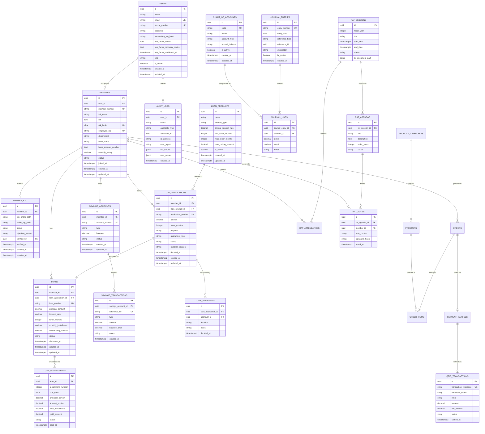

# Diagram Relasi Entitas & Skema Basis Data (ERD.md)
## Sistem Koperasi Digital (*KopKar Digital*)

* **Database Engine**: PostgreSQL 16+
* **Presisi Moneter**: `DECIMAL(15, 2)` (Zero Float)
* **Kunci Utama**: `UUID` (v7)

---

## 1. Diagram Relasi Entitas (*Entity Relationship Diagram*)



---

## 2. Kamus Data & Spesifikasi Kolom (*Data Dictionary*)

### 2.1. Tabel `users`, `members` & `member_kyc`
Tabel utama autentikasi dan profil keanggotaan koperasi karyawan:

```sql
CREATE TABLE users (
    id UUID PRIMARY KEY DEFAULT gen_random_uuid(),
    name VARCHAR(255) NOT NULL,
    email VARCHAR(255) UNIQUE NOT NULL,
    phone_number VARCHAR(32) UNIQUE NOT NULL,
    password VARCHAR(255) NOT NULL,
    transaction_pin_hash VARCHAR(255),
    two_factor_secret TEXT, -- terenkripsi; wajib diisi untuk role superadmin (rules/security.md §1)
    two_factor_recovery_codes TEXT, -- terenkripsi; array JSON berisi hash bcrypt, sekali pakai
    two_factor_confirmed_at TIMESTAMPTZ,
    role VARCHAR(32) NOT NULL DEFAULT 'member', -- member, treasurer, chairman, auditor, superadmin
    is_active BOOLEAN NOT NULL DEFAULT TRUE,
    created_at TIMESTAMPTZ NOT NULL DEFAULT NOW(),
    updated_at TIMESTAMPTZ NOT NULL DEFAULT NOW()
);

CREATE TABLE members (
    id UUID PRIMARY KEY DEFAULT gen_random_uuid(),
    user_id UUID NOT NULL UNIQUE REFERENCES users(id) ON DELETE RESTRICT,
    member_number VARCHAR(32) UNIQUE, -- NULL hingga keanggotaan AKTIF (lihat §5.1 BRD.md); format KOP-2026-00001
    full_name VARCHAR(255) NOT NULL,
    nik TEXT NOT NULL, -- Terenkripsi (Laravel Crypt/AES-256); TIDAK unik langsung karena ciphertext non-deterministik
    nik_hash CHAR(64) UNIQUE NOT NULL, -- HMAC-SHA256(nik, APP_KEY) — dipakai untuk deduplikasi & pencarian tanpa dekripsi
    employee_nip VARCHAR(64) UNIQUE NOT NULL,
    department VARCHAR(128) NOT NULL,
    bank_name VARCHAR(64) NOT NULL,
    bank_account_number TEXT NOT NULL, -- Terenkripsi (Laravel Crypt)
    monthly_salary DECIMAL(15, 2) NOT NULL DEFAULT 0.00,
    status VARCHAR(32) NOT NULL DEFAULT 'pending', -- pending, active, resigned, suspended
    joined_at TIMESTAMPTZ,
    created_at TIMESTAMPTZ NOT NULL DEFAULT NOW(),
    updated_at TIMESTAMPTZ NOT NULL DEFAULT NOW()
);

CREATE TABLE member_kyc (
    id UUID PRIMARY KEY DEFAULT gen_random_uuid(),
    member_id UUID NOT NULL UNIQUE REFERENCES members(id) ON DELETE RESTRICT,
    ktp_photo_path VARCHAR(255) NOT NULL, -- path privat di MinIO/S3, diakses via presigned URL (maks. 5 menit)
    selfie_ktp_path VARCHAR(255) NOT NULL,
    status VARCHAR(32) NOT NULL DEFAULT 'pending', -- pending, approved, rejected
    rejection_reason VARCHAR(255),
    verified_by UUID REFERENCES users(id) ON DELETE SET NULL,
    verified_at TIMESTAMPTZ,
    created_at TIMESTAMPTZ NOT NULL DEFAULT NOW(),
    updated_at TIMESTAMPTZ NOT NULL DEFAULT NOW()
);
```

> **Catatan implementasi (NIK)**: enkripsi standar (mis. `'nik' => 'encrypted'` di Eloquent) menghasilkan ciphertext acak per baris (IV berbeda setiap kali), sehingga `UNIQUE` langsung pada kolom terenkripsi **tidak berfungsi** untuk mendeteksi NIK duplikat. Solusinya, `nik` menyimpan ciphertext (untuk ditampilkan kembali via dekripsi), sedangkan `nik_hash` menyimpan digest HMAC deterministik dari NIK asli — kolom inilah yang diberi constraint `UNIQUE` dan dipakai untuk validasi "NIK sudah terdaftar" saat registrasi.

---

### 2.2. Tabel `savings_accounts` & `savings_transactions`
Mengelola rekening simpanan anggota (Pokok, Wajib, Sukarela):

```sql
CREATE TABLE savings_accounts (
    id UUID PRIMARY KEY DEFAULT gen_random_uuid(),
    member_id UUID NOT NULL REFERENCES members(id) ON DELETE RESTRICT,
    account_number VARCHAR(32) UNIQUE NOT NULL,
    type VARCHAR(32) NOT NULL, -- pokok, wajib, sukarela
    balance DECIMAL(15, 2) NOT NULL DEFAULT 0.00,
    status VARCHAR(32) NOT NULL DEFAULT 'active',
    created_at TIMESTAMPTZ NOT NULL DEFAULT NOW(),
    updated_at TIMESTAMPTZ NOT NULL DEFAULT NOW(),
    CONSTRAINT chk_savings_balance_positive CHECK (balance >= 0),
    CONSTRAINT uq_member_savings_type UNIQUE (member_id, type) -- satu anggota hanya punya 1 rekening per jenis (pokok/wajib/sukarela)
);

CREATE TABLE savings_transactions (
    id UUID PRIMARY KEY DEFAULT gen_random_uuid(),
    savings_account_id UUID NOT NULL REFERENCES savings_accounts(id) ON DELETE RESTRICT,
    reference_no VARCHAR(64) UNIQUE NOT NULL,
    type VARCHAR(32) NOT NULL, -- deposit, withdrawal, interest, transfer
    amount DECIMAL(15, 2) NOT NULL,
    balance_after DECIMAL(15, 2) NOT NULL,
    notes TEXT,
    created_at TIMESTAMPTZ NOT NULL DEFAULT NOW(),
    CONSTRAINT chk_transaction_amount_gt_zero CHECK (amount > 0)
);
```

---

### 2.3. Tabel Pinjaman (`loan_products`, `loan_applications`, `loan_approvals`, `loans`, `loan_installments`)
Mengelola produk pinjaman, alur pengajuan & persetujuan berjenjang, pinjaman aktif, dan jadwal angsuran amortisasi (BRD.md §5.3):

```sql
CREATE TABLE loan_products (
    id UUID PRIMARY KEY DEFAULT gen_random_uuid(),
    name VARCHAR(128) NOT NULL,
    interest_type VARCHAR(16) NOT NULL, -- flat, sliding
    annual_interest_rate DECIMAL(6, 4) NOT NULL, -- suku bunga TAHUNAN; dikonversi ÷12 saat kalkulasi bulanan (BRD.md §5.3.2)
    min_tenor_months INTEGER NOT NULL,
    max_tenor_months INTEGER NOT NULL,
    max_ceiling_amount DECIMAL(15, 2) NOT NULL, -- plafon maksimal per-produk (independen dari plafon 3x simpanan per anggota)
    is_active BOOLEAN NOT NULL DEFAULT TRUE,
    created_at TIMESTAMPTZ NOT NULL DEFAULT NOW(),
    updated_at TIMESTAMPTZ NOT NULL DEFAULT NOW(),
    CONSTRAINT chk_loan_tenor_positive CHECK (min_tenor_months > 0 AND max_tenor_months >= min_tenor_months)
);

CREATE TABLE loan_applications (
    id UUID PRIMARY KEY DEFAULT gen_random_uuid(),
    member_id UUID NOT NULL REFERENCES members(id) ON DELETE RESTRICT,
    loan_product_id UUID NOT NULL REFERENCES loan_products(id) ON DELETE RESTRICT,
    application_number VARCHAR(32) UNIQUE NOT NULL, -- LON-20260914-123456
    amount DECIMAL(15, 2) NOT NULL,
    tenor_months INTEGER NOT NULL,
    purpose VARCHAR(500) NOT NULL,
    guarantee_type VARCHAR(32), -- payroll, bpjs, vehicle, property
    status VARCHAR(32) NOT NULL DEFAULT 'pending_review', -- pending_review, approved, rejected
    rejection_reason VARCHAR(255),
    decided_at TIMESTAMPTZ,
    created_at TIMESTAMPTZ NOT NULL DEFAULT NOW(),
    updated_at TIMESTAMPTZ NOT NULL DEFAULT NOW(),
    CONSTRAINT chk_loan_application_amount_positive CHECK (amount > 0)
);

CREATE TABLE loan_approvals (
    id UUID PRIMARY KEY DEFAULT gen_random_uuid(),
    loan_application_id UUID NOT NULL REFERENCES loan_applications(id) ON DELETE RESTRICT,
    approver_id UUID NOT NULL REFERENCES users(id) ON DELETE RESTRICT,
    decision VARCHAR(16) NOT NULL, -- approved, rejected
    notes VARCHAR(255),
    decided_at TIMESTAMPTZ NOT NULL DEFAULT NOW(),
    CONSTRAINT uq_loan_application_approver UNIQUE (loan_application_id, approver_id) -- 1 approver = 1 keputusan per pengajuan
);

CREATE TABLE loans (
    id UUID PRIMARY KEY DEFAULT gen_random_uuid(),
    member_id UUID NOT NULL REFERENCES members(id) ON DELETE RESTRICT,
    loan_application_id UUID NOT NULL UNIQUE REFERENCES loan_applications(id) ON DELETE RESTRICT,
    loan_number VARCHAR(32) UNIQUE NOT NULL,
    principal_amount DECIMAL(15, 2) NOT NULL,
    interest_rate DECIMAL(6, 4) NOT NULL, -- disalin dari loan_products.annual_interest_rate saat pencairan
    tenor_months INTEGER NOT NULL,
    monthly_installment DECIMAL(15, 2) NOT NULL, -- representatif (angsuran bulan ke-1); rincian per bulan ada di loan_installments
    outstanding_balance DECIMAL(15, 2) NOT NULL,
    status VARCHAR(32) NOT NULL DEFAULT 'active', -- active, paid_off, defaulted
    disbursed_at TIMESTAMPTZ,
    created_at TIMESTAMPTZ NOT NULL DEFAULT NOW(),
    updated_at TIMESTAMPTZ NOT NULL DEFAULT NOW(),
    CONSTRAINT chk_principal_positive CHECK (principal_amount > 0),
    CONSTRAINT chk_outstanding_non_negative CHECK (outstanding_balance >= 0)
);

CREATE TABLE loan_installments (
    id UUID PRIMARY KEY DEFAULT gen_random_uuid(),
    loan_id UUID NOT NULL REFERENCES loans(id) ON DELETE RESTRICT,
    installment_number INTEGER NOT NULL,
    due_date DATE NOT NULL,
    principal_portion DECIMAL(15, 2) NOT NULL,
    interest_portion DECIMAL(15, 2) NOT NULL,
    total_installment DECIMAL(15, 2) NOT NULL,
    paid_amount DECIMAL(15, 2) NOT NULL DEFAULT 0.00,
    status VARCHAR(32) NOT NULL DEFAULT 'unpaid', -- unpaid, partial, paid, overdue
    paid_at TIMESTAMPTZ,
    CONSTRAINT uq_loan_installment UNIQUE (loan_id, installment_number)
);
```

> **Catatan persetujuan berjenjang**: jumlah keputusan `approved` yang dibutuhkan pada `loan_approvals` sebelum sebuah `loan_applications` boleh berpindah status menjadi `approved` bergantung pada nominal `amount` (BRD.md §5.3.3: ≤Rp5jt = 1 approval, Rp5jt–25jt = 2 approval, >Rp25jt = 2 approval khusus jenjang tertinggi — lihat `config('koperasi.loan.approval_tiers')`). Satu keputusan `rejected` langsung menolak seluruh pengajuan (veto tunggal), terlepas dari berapa banyak persetujuan yang sudah terkumpul.

---

### 2.4. Tabel Akuntansi Berpasangan (`chart_of_accounts`, `journal_entries`, `journal_lines`)
Menjamin kepatuhan standar pembukuan SAK EP dan auditabilitas finansial:

```sql
CREATE TABLE chart_of_accounts (
    id UUID PRIMARY KEY DEFAULT gen_random_uuid(),
    code VARCHAR(32) UNIQUE NOT NULL, -- 1-1000 Kas, 1-1200 Piutang Pinjaman, 4-1000 Pendapatan Bunga Pinjaman, dll.
    name VARCHAR(128) NOT NULL,
    account_type VARCHAR(32) NOT NULL, -- asset, liability, equity, revenue, expense
    normal_balance VARCHAR(16) NOT NULL, -- debit, credit
    is_active BOOLEAN NOT NULL DEFAULT TRUE,
    created_at TIMESTAMPTZ NOT NULL DEFAULT NOW(),
    updated_at TIMESTAMPTZ NOT NULL DEFAULT NOW()
);

CREATE TABLE journal_entries (
    id UUID PRIMARY KEY DEFAULT gen_random_uuid(),
    entry_number VARCHAR(64) UNIQUE NOT NULL, -- JRN-20260914-0001
    entry_date DATE NOT NULL,
    reference_type VARCHAR(64), -- savings_transaction, loan, loan_installment, kopmart_order
    reference_id UUID,
    description TEXT NOT NULL,
    is_posted BOOLEAN NOT NULL DEFAULT TRUE,
    created_at TIMESTAMPTZ NOT NULL DEFAULT NOW()
);

CREATE TABLE journal_lines (
    id UUID PRIMARY KEY DEFAULT gen_random_uuid(),
    journal_entry_id UUID NOT NULL REFERENCES journal_entries(id) ON DELETE RESTRICT,
    account_id UUID NOT NULL REFERENCES chart_of_accounts(id) ON DELETE RESTRICT,
    debit DECIMAL(15, 2) NOT NULL DEFAULT 0.00,
    credit DECIMAL(15, 2) NOT NULL DEFAULT 0.00,
    notes VARCHAR(255),
    CONSTRAINT chk_debit_credit_positive CHECK (debit >= 0 AND credit >= 0),
    CONSTRAINT chk_debit_xor_credit CHECK ((debit > 0 AND credit = 0) OR (credit > 0 AND debit = 0))
);
```

---

### 2.5. Tabel Tata Kelola RAT (`rat_sessions`, `rat_agendas`, `rat_votes`)
Menjamin pemungutan suara sah berlandaskan asas *"One Member, One Vote"*:

```sql
CREATE TABLE rat_sessions (
    id UUID PRIMARY KEY DEFAULT gen_random_uuid(),
    fiscal_year INTEGER NOT NULL UNIQUE,
    title VARCHAR(255) NOT NULL,
    start_time TIMESTAMPTZ NOT NULL,
    end_time TIMESTAMPTZ NOT NULL,
    status VARCHAR(32) NOT NULL DEFAULT 'draft', -- draft, active, closed
    lpj_document_path VARCHAR(255)
);

CREATE TABLE rat_agendas (
    id UUID PRIMARY KEY DEFAULT gen_random_uuid(),
    rat_session_id UUID NOT NULL REFERENCES rat_sessions(id) ON DELETE RESTRICT,
    title VARCHAR(255) NOT NULL,
    description TEXT,
    order_index INTEGER NOT NULL DEFAULT 1,
    status VARCHAR(32) NOT NULL DEFAULT 'open'
);

CREATE TABLE rat_votes (
    id UUID PRIMARY KEY DEFAULT gen_random_uuid(),
    rat_agenda_id UUID NOT NULL REFERENCES rat_agendas(id) ON DELETE RESTRICT,
    member_id UUID NOT NULL REFERENCES members(id) ON DELETE RESTRICT,
    vote_choice VARCHAR(16) NOT NULL, -- agree, disagree, abstain
    signature_hash VARCHAR(255) NOT NULL, -- Hash pengaman integritas suara
    voted_at TIMESTAMPTZ NOT NULL DEFAULT NOW(),
    CONSTRAINT uq_member_agenda_vote UNIQUE (rat_agenda_id, member_id)
);
```

---

### 2.6. Tabel Jejak Audit (`audit_logs`)
Jejak audit mutlak untuk setiap aksi finansial & administratif (rules/security.md §3.1) — tidak dapat diubah atau dihapus setelah dicatat:

```sql
CREATE TABLE audit_logs (
    id UUID PRIMARY KEY DEFAULT gen_random_uuid(),
    user_id UUID REFERENCES users(id) ON DELETE SET NULL, -- NULL untuk aksi sistem otomatis (mis. pencairan pinjaman)
    event VARCHAR(128) NOT NULL, -- mis. member.kyc_approved, loan.disbursed, admin.login_succeeded
    auditable_type VARCHAR(128), -- kelas model terkait (polymorphic)
    auditable_id UUID,
    ip_address VARCHAR(45),
    user_agent TEXT,
    old_values JSONB,
    new_values JSONB,
    created_at TIMESTAMPTZ NOT NULL DEFAULT NOW()
);
```

---

## 3. Aturan Keseimbangan Debit-Kredit (*Double-Entry Balancing Trigger*)

Fungsi database trigger untuk memastikan sebuah `journal_entry` tidak dapat diposting jika total Debit $\neq$ total Kredit:

```sql
CREATE OR REPLACE FUNCTION verify_journal_entry_balance()
RETURNS TRIGGER AS $$
DECLARE
    v_total_debit DECIMAL(15, 2);
    v_total_credit DECIMAL(15, 2);
BEGIN
    SELECT COALESCE(SUM(debit), 0), COALESCE(SUM(credit), 0)
    INTO v_total_debit, v_total_credit
    FROM journal_lines
    WHERE journal_entry_id = NEW.journal_entry_id;

    IF v_total_debit <> v_total_credit THEN
        RAISE EXCEPTION 'Ketidakseimbangan Jurnal: Total Debit (%) tidak sama dengan Total Kredit (%)', 
            v_total_debit, v_total_credit;
    END IF;

    RETURN NEW;
END;
$$ LANGUAGE plpgsql;
```
