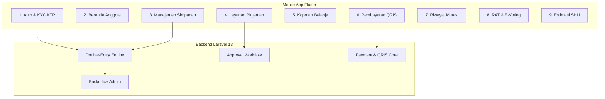

# Dokumen Kebutuhan Produk (PRD.md)
## Sistem Koperasi Digital (*KopKar Digital*)

* **Versi Produk**: 2.0.0
* **Platform**: Mobile (Flutter Android & iOS) & Backoffice Web (Laravel 13)
* **Status**: Siap Implementasi (*Ready for Implementation*)

---

## 1. Ikhtisar Produk (*Product Overview*)
**KopKar Digital** adalah aplikasi finansial cerdas yang dirancang khusus untuk anggota dan pengurus koperasi karyawan. Aplikasi ini memfasilitasi seluruh interaksi finansial harian: pemantauan tabungan, pengajuan dan cicilan pinjaman tanpa tatap muka, belanja di toko koperasi (Kopmart), transaksi pembayaran QRIS nasional, hingga pemungutan suara demokratis pada Rapat Anggota Tahunan (RAT).

---

## 2. Persona Pengguna (*User Personas*)

### Persona 1: Anggota Karyawan
* **Nama**: Budi Santoso (32 tahun, Karyawan Divisi Logistik).
* **Kebutuhan**: Memantau tabungan koperasi, mengajukan pinjaman darurat dengan cepat tanpa prosedur birokrasi berbelit, berbelanja sembako dengan skema potong gaji, dan mengikuti pemilihan pengurus RAT dari ponsel pintarnya.
* **Titik Kesulitan Saat Ini**: Tidak tahu berapa total simpanan yang terkumpul, slip pinjaman manual sering terselip, dan tidak pernah sempat hadir saat RAT fisik.

### Persona 2: Bendahara Koperasi
* **Nama**: Siti Rahmawati (42 tahun, Bendahara Pengurus).
* **Kebutuhan**: Memvalidasi kelayakan pinjaman secara instan, menyetujui pencairan dana, memonitor arus kas harian, dan memastikan buku besar akuntansi selalu seimbang tanpa kerja lembur akhir bulan.
* **Titik Kesulitan Saat Ini**: Merekap ribuan mutasi manual di Excel, stres menghadapi rekonsiliasi jurnal yang selisih, dan menagih pinjaman macet.

### Persona 3: Dewan Pengawas & Pengurus Koperasi
* **Nama**: Ir. Hendra Gunawan (50 tahun, Ketua Dewan Pengawas).
* **Kebutuhan**: Memeriksa kepatuhan rasio likuiditas koperasi, meninjau transparansi penggunaan dana kas via portal Web, dan mengaudit keaslian hasil suara pada RAT digital.

### Persona 4: Super Admin (Web Backoffice Specialist)
* **Nama**: Reza Pratama (30 tahun, IT & System Administrator Koperasi).
* **Kebutuhan**: Mengelola operasional sistem secara menyeluruh melalui **Web Browser (Laravel)**: manajemen role/permission pengurus, audit log aktivitas transaksi, konfigurasi suku bunga/plafon global, integrasi payment gateway, dan backup data.
* **Perangkat Akses**: Laptop / Desktop PC via Web Browser.

---

## 3. Matriks Pembagian Platform Berdasarkan Peran

| Peran (*User Role*) | Platform Akses | Tumpukan Teknologi | Lingkup Fitur |
| :--- | :---: | :---: | :--- |
| **Super Admin** | **Web Application** | **Laravel 13 Web / Blade** | Kontrol sistem penuh, RBAC, konfigurasi suku bunga & plafon, audit log viewer, manajemen master akun. |
| **Pengurus (Bendahara, Ketua, Admin)** | **Web Application** | **Laravel 13 Web / Blade** | Verifikasi KYC, persetujuan pinjaman, pembukuan jurnal akuntansi, manajemen toko Kopmart, rilis agenda RAT & LPJ. |
| **Pengawas Koperasi** | **Web Application** | **Laravel 13 Web / Blade** | Audit buku besar (*read-only*), neraca saldo, monitoring rasio keuangan koperasi. |
| **Anggota Koperasi (Karyawan)** | **Mobile Application** | **Flutter (Android & iOS)** | Pendaftaran & KYC, cek saldo simpanan, setor/tarik saldo sukarela, ajukan pinjaman, bayar cicilan, belanja Kopmart, bayar QRIS, voting RAT, proyeksi SHU. |

---

## 4. Matriks Fitur & Modul Fungsional (*Functional Specifications*)

---

### Modul 1: Autentikasi, KYC & Pendaftaran Anggota
* **Alur Pengguna**:
  1. Pengguna memasukkan Nama Lengkap, Nomor HP, Email, NIP Karyawan, dan Password.
  2. Verifikasi OTP dikirimkan via WhatsApp / SMS.
  3. Pengguna mengunggah foto KTP dan memasukkan 16 digit NIK.
  4. Pengguna diarahkan ke layar `KYC Pending` dengan instruksi penyelesaian pembayaran **Simpanan Pokok** melalui Virtual Account.
  5. Setelah Simpanan Pokok terkonfirmasi, akun otomatis berstatus aktif dan diterbitkan NAK resmi.
* **Kriteria Penerimaan (*Acceptance Criteria*)**:
  * NIK wajib tervalidasi 16 digit angka dan unik di database.
  * Foto KTP dienkripsi dan disimpan di private bucket.
  * Akun tidak dapat melakukan pengajuan pinjaman sebelum status KYC disetujui.

---

### Modul 2: Beranda Anggota (*Member Dashboard*)
*Merujuk pada desain: `design/beranda_anggota`*
* **Komponen Utama**:
  * **Financial Hero Card**: Menampilkan total akumulasi aset simpanan dengan tombol sembunyikan saldo (*masking* `Rp ••••••••`), tombol Setor Dana Cepat, dan Tarik Saldo.
  * **Quick Action Grid**: 4 pintasan utama: *Simpanan*, *Pinjaman*, *Kopmart*, dan *Bayar QRIS*.
  * **Kartu Pinjaman Berjalan**: Menampilkan sisa pokok pinjaman aktif, tanggal jatuh tempo angsuran berikutnya, dan tombol "Bayar Angsuran".
  * **Banner Promo & Berita Koperasi**: Informasi dividen tahunan, pengumuman jadwal RAT, atau diskon sembako Kopmart.

---

### Modul 3: Manajemen Simpanan (*Savings Management*)
*Merujuk pada desain: `design/manajemen_simpanan`*
* **Fitur**:
  * Tiga kartu sub-saldo: **Simpanan Pokok**, **Simpanan Wajib**, dan **Simpanan Sukarela**.
  * **Setor Simpanan**: Anggota dapat memilih jenis simpanan, menginput nominal, dan memilih saluran pembayaran (BCA, Mandiri, BRI, BNI Virtual Account, atau QRIS).
  * **Tarik Simpanan Sukarela**: Validasi kecukupan saldo (saldo mengendap minimal Rp 50.000). Penarikan diverifikasi dengan PIN 6 digit dan ditransfer otomatis ke rekening bank terdaftar anggota.
  * Mutasi riwayat khusus akun simpanan.

---

### Modul 4: Layanan Pinjaman (*Loan Services*)
*Merujuk pada desain: `design/layanan_pinjaman`*
* **Fitur**:
  * **Kalkulator Pinjaman Interaktif**: Slider dinamis untuk memilih nominal pinjaman dan tenor (3, 6, 12, 24, 36 bulan), serta pemilihan skema bunga (**Flat** atau **Sliding**). Rincian angsuran pokok dan bunga terhitung secara instan di layar.
  * **Validasi Plafon Real-Time**: Sistem secara otomatis menghitung batas maksimal plafon ($3 \times$ total simpanan). Jika pengajuan melebihi plafon, form menampilkan peringatan dan mencegah submit.
  * **Formulir Pengajuan Pinjaman**: Pengisian tujuan pembiayaan, opsi jaminan (Payroll/BPJS Ketenagakerjaan/Kendaraan), dan persetujuan syarat & ketentuan.
  * **Status Tracker**: Pelacakan status permohonan (*Menunggu Review $\rightarrow$ Analisis Komite $\rightarrow$ Disetujui $\rightarrow$ Dana Dicairkan*).
  * **Pembayaran Angsuran**: Bayar via saldo sukarela atau Virtual Account.

---

### Modul 5: Kopmart & Belanja Karyawan
*Merujuk pada desain: `design/kopmart_belanja_karyawan`*
* **Fitur**:
  * Katalog barang kebutuhan pokok, perlengkapan kantor, dan voucher belanja.
  * Fitur Keranjang Belanja (*Cart*) dan kalkulasi total belanja.
  * Opsi Pembayaran:
    1. Potong Saldo Simpanan Sukarela (Instan).
    2. Kasbon Karyawan / Payroll Cut (Dipotong langsung dari gaji akhir bulan).

---

### Modul 6: Pembayaran QRIS (*QRIS Payment Core*)
*Merujuk pada desain: `design/bayar_via_qris`, `design/konfirmasi_bayar_qris`, `design/bukti_pembayaran_qris`*
* **Fitur**:
  * **Pemindai Kamera QR**: Pindai kode QRIS standar Bank Indonesia secara instan atau unggah gambar QR dari galeri ponsel.
  * **Lembar Konfirmasi Pembayaran (*Confirmation Bottom Sheet*)**: Menampilkan Nama Merchant, National Merchant ID (NMID), Nominal Transaksi, dan Biaya Layanan (jika ada).
  * **Otorisasi PIN Transaksi**: Wajib memasukkan PIN 6 digit sebelum pemotongan saldo.
  * **Bukti Pembayaran Digital (*Digital Receipt*)**: Tampilan struk digital resmi lengkap dengan Nomor Referensi Transaksi, waktu WIB, dan tombol "Simpan/Bagikan Struk".

---

### Modul 7: Riwayat Transaksi & Mutasi Keuangan
*Merujuk pada desain: `design/riwayat_transaksi_mutasi`*
* **Fitur**:
  * Rekapitulasi mutasi dana masuk (hijau) dan keluar (hitam).
  * Filter rentang tanggal (Bulan Ini, 3 Bulan Terakhir, Kustom).
  * Filter kategori transaksi: *Semua, Simpanan, Pinjaman, Kopmart, Tarik Tunai*.
  * Fitur Ekspor Laporan Rekening Koran dalam format PDF bertanda tangan digital.

---

### Modul 8: RAT Digital & E-Voting
* **Fitur**:
  * **Konfirmasi Kehadiran Kuorum**: Anggota melakukan absensi digital untuk memenuhi syarat kuorum sah $\ge 50\% + 1$.
  * **Dokumen LPJ Terpadu**: Pratinjau dan unduh berkas Laporan Pertanggungjawaban Pengurus & Pengawas tahun buku berjalan.
  * **Bilik E-Voting**:
    * Daftar agenda pemungutan suara (misal: "Persetujuan LPJ Tahun Buku 2025", "Rencana Kerja & Anggaran 2026").
    * Tombol suara: **Setuju**, **Tolak**, **Abstain**.
    * Hasil tabulasi persentase suara ditampilkan dalam bentuk grafik batang interaktif secara *real-time*.

---

### Modul 9: Sisa Hasil Usaha (SHU) & Akuntansi
* **Fitur**:
  * **Kalkulator Estimasi SHU Anggota**: Memproyeksikan dividen yang akan diterima anggota berdasarkan simpanan dan aktivitas belanjanya.
  * **Pembukuan Otomatis (*Automated Double-Entry Ledger*)**: Setiap transaksi di aplikasi otomatis mendebit dan mengkredit akun perkiraan yang tepat di buku besar.
  * **Laporan Keuangan Real-Time**: Neraca Keuangan (*Balance Sheet*) dan Laporan Perhitungan Hasil Usaha (*Income Statement*) selalu seimbang (*balanced*).

---

## 4. Kebutuhan Non-Fungsional (*Non-Functional Requirements*)

1. **Performa & Kecepatan Respons**:
   * Waktu muat awal aplikasi mobile: $< 2.0$ detik.
   * Latensi pemanggilan API: $< 200$ ms pada persentil p95.
2. **Keandalan (*Reliability & Availability*)**:
   * Ketersediaan sistem (*Uptime*): Minimal **99.9%**.
   * Transaksi finansial menjamin prinsip ACID; zero data loss dan perlindungan dari *double-spending*.
3. **Keamanan (*Security & Compliance*)**:
   * Enkripsi data sensitif anggota (NIK, data bank) menggunakan AES-256.
   * Transmisi data wajib menggunakan TLS 1.3 dengan perlindungan *SSL Pinning*.
   * Proteksi rate-limiting pada endpoint autentikasi dan otorisasi PIN.
4. **Aksesibilitas & Tampilan (*Usability*)**:
   * Memenuhi pedoman kontras warna WCAG 2.1 Level AA.
   * Ukuran target sentuh interaktif minimal 48 x 48 dp.
   * Kompatibel penuh dengan Android 8.0+ (API level 26+) dan iOS 14.0+.
