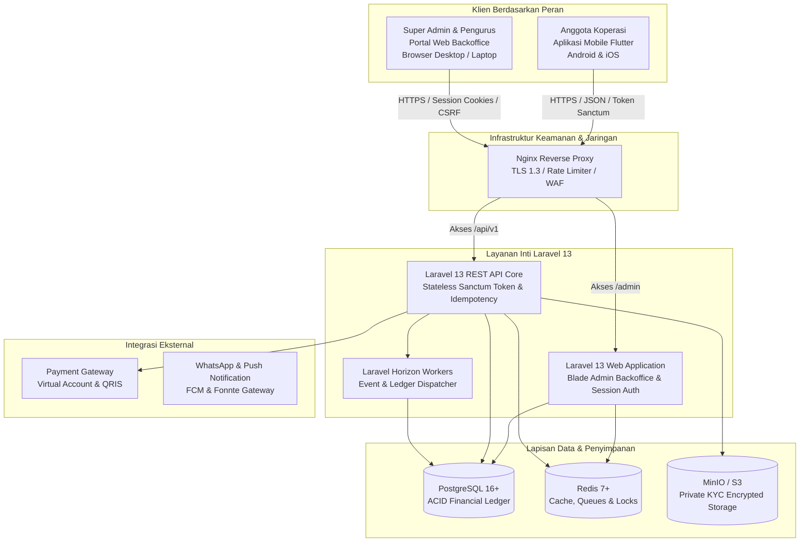
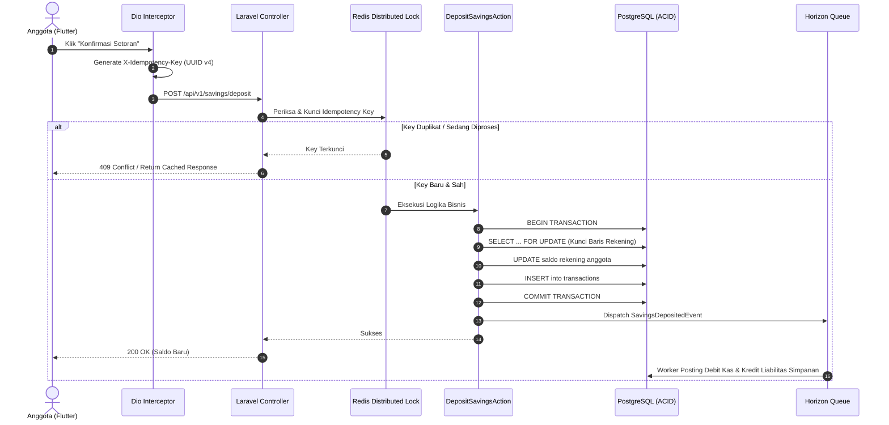
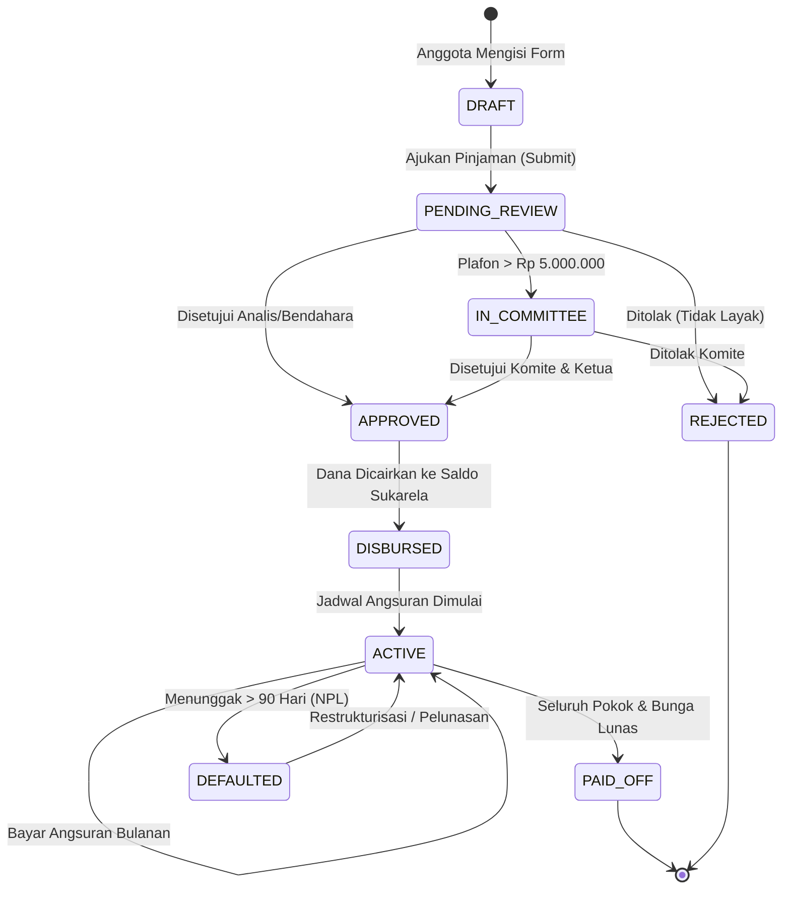

# Arsitektur Sistem & Desain Teknis (arsitektur.md)
## Sistem Koperasi Digital (*KopKar Digital*)

* **Arsitektur**: Headless Decoupled Micro-Modular
* **Backend**: Laravel 13 (REST API)
* **Frontend**: Flutter (Mobile Client Android & iOS)
* **Database**: PostgreSQL 16+ (ACID Single Source of Truth)

---

## 1. Diagram Arsitektur Tingkat Tinggi (*C4 Container Diagram*)



---

## 2. Pola Arsitektur Perangkat Lunak (*Clean Architecture*)

### 2.1. Lapisan Backend (Laravel 13)
Backend menerapkan pemisahan tanggung jawab berbasis *Domain-Driven Clean Architecture*:

```
backend/
├── app/
│   ├── Actions/               # Application Use Cases (Single Action Classes)
│   │   ├── Loans/             # ApplyLoanAction, ApproveLoanAction, DisburseLoanAction
│   │   ├── Savings/           # DepositSavingsAction, WithdrawSavingsAction
│   │   └── Accounting/        # PostJournalEntryAction
│   ├── Enums/                 # Backed Enums (LoanStatus, SavingsType, TransactionType)
│   ├── Events/                # Domain Events (SavingsDeposited, LoanApproved)
│   ├── Exceptions/            # Custom Domain Exceptions (InsufficientBalanceException)
│   ├── Http/
│   │   ├── Controllers/Api/V1/# Thin Invokable Controllers
│   │   ├── Requests/          # Form Requests dengan validasi ketat
│   │   └── Resources/         # JSON API Resources Transformer
│   ├── Listeners/             # Async Event Listeners (Buku besar, Notifikasi)
│   ├── Models/                # Eloquent Models dengan UUID & Type Casting
│   ├── Repositories/          # Abstraksi kueri database
│   └── Services/              # Layanan domain murni (Kalkulasi bunga, SHU)
```

### 2.2. Lapisan Mobile (Flutter)
Aplikasi mobile menerapkan *Feature-First Clean Architecture*:

```
mobile/
├── lib/
│   ├── core/                  # Network (Dio), storage, errors, formatters
│   ├── features/
│   │   ├── home/              # Beranda Anggota
│   │   ├── savings/           # Simpanan Pokok, Wajib, Sukarela
│   │   ├── loans/             # Pinjaman & Kalkulator
│   │   ├── kopmart/           # Belanja Karyawan
│   │   ├── qris/              # Scanner & Pembayaran QRIS
│   │   └── rat/               # RAT Digital & E-Voting
│   └── shared/                # Reusable widgets, themes, design tokens
```

---

## 3. Siklus Transaksi Finansial & Mesin Idempotensi

Setiap transaksi penambahan atau pemotongan dana anggota wajib melalui pipa pengamanan berikut:



---

## 4. Mesin Status Pinjaman (*Loan Lifecycle State Machine*)



---

## 5. Cetak Biru Struktur Direktori Repositori (*Monorepo Blueprint*)

```
koperasi-digital/
├── .agents/                   # Aturan & Customizations Antigravity IDE
│   └── rules/                 # 17 Berkas Aturan Teknis
├── backend/                   # Backend Laravel 13 (Web Superadmin & API Mobile)
│   ├── app/
│   │   ├── Http/Controllers/Web/Admin/ # Controllers Web Backoffice Superadmin
│   │   └── Http/Controllers/Api/V1/    # Controllers REST API Mobile Anggota
│   ├── config/
│   ├── database/migrations/   # Migrasi Skema PostgreSQL
│   ├── resources/views/admin/ # Blade View Backoffice Superadmin
│   ├── routes/web.php         # Rute Portal Web Superadmin (/admin)
│   ├── routes/api.php         # Rute REST API Mobile Flutter (/api/v1)
│   └── tests/                 # Pest PHP Feature & Unit Tests
├── mobile/                    # Kode Sumber Aplikasi Flutter (Android/iOS)
│   ├── lib/
│   ├── assets/                # Font Plus Jakarta Sans, Inter, Icon SVG
│   └── test/                  # Widget & Unit Tests
├── design/                    # Aset Desain UI/UX Mobile Flutter
│   ├── beranda_anggota/       # HTML Mockup & Screenshot Beranda
│   ├── manajemen_simpanan/    # Layar Manajemen Simpanan
│   ├── layanan_pinjaman/      # Layar Pinjaman & Kalkulator
│   ├── kopmart_belanja_karyawan/
│   ├── bayar_via_qris/
│   ├── konfirmasi_bayar_qris/
│   ├── bukti_pembayaran_qris/
│   ├── riwayat_transaksi_mutasi/
│   └── kopkar_digital/        # Token Desain & Styling System
├── docker/                    # Konfigurasi Nginx & Dockerfile
├── rules/                     # Salinan 17 Berkas Aturan Resmi
├── PRD.md                     # Product Requirements Document
├── BRD.md                     # Business Requirements Document
├── ERD.md                     # Entity Relationship Diagram
├── techstack.md               # Spesifikasi Tumpukan Teknologi
├── arsitektur.md              # Arsitektur Sistem & Alur
├── AGENTS.md                  # Master Panduan AI Pair-Programmer
└── docker-compose.yml         # Orkestrasi Layanan Lokal
```
