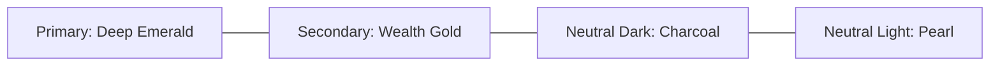

# Design System & UI/UX Guidelines - Koperasi Digital

Dokumen ini mendefinisikan sistem desain (Design System) untuk **Koperasi Digital**, termasuk identitas warna, tipografi, elemen UI, serta prinsip-prinsip UX. Pedoman ini bertujuan untuk menjaga konsistensi visual dan memberikan pengalaman pengguna yang premium, modern, dan tepercaya.

---

## 1. Identitas Warna (Color Palette)

Koperasi identik dengan kebersamaan, pertumbuhan ekonomi, dan kemakmuran. Oleh karena itu, skema warna utama dipilih dengan kombinasi hijau botani (kepercayaan & pertumbuhan) dan emas (kesejahteraan/kemakmuran).



### 1.1 Palet Utama (Core Palette)

| Nama Warna | Kode Hex | Representasi CSS/Tailwind | Kegunaan |
| :--- | :--- | :--- | :--- |
| **Primary (Deep Emerald)** | `#0D5C3A` | `bg-emerald-800` / `text-emerald-800` | Warna dominan brand: Header, tombol aksi utama, status aktif, dan aksen penting. |
| **Secondary (Wealth Gold)** | `#E5A93B` | `bg-amber-500` / `text-amber-500` | Aksen sekunder: Notifikasi penting, bintang rating, info saldo emas, atau tombol highlight. |
| **Neutral Dark (Charcoal)** | `#0F172A` | `bg-slate-900` / `text-slate-900` | Teks utama, judul utama, latar belakang dashboard (mode gelap). |
| **Neutral Light (Pearl)** | `#F8FAFC` | `bg-slate-50` / `text-slate-50` | Latar belakang halaman (mode terang), latar belakang kartu data, border tipis. |

### 1.2 Palet Semantik (Semantic Palette)

Warna indikator status transaksi keuangan yang wajib dipatuhi secara konsisten:

*   🟢 **Success (Hijau):** `#10B981` (`emerald-500`) - Transaksi berhasil, pinjaman disetujui, cicilan terbayar.
*   🟡 **Warning (Kuning/Oranye):** `#F59E0B` (`amber-500`) - Transaksi tertunda (pending), review berkas KYC, pembayaran segera jatuh tempo.
*   🔴 **Danger (Merah):** `#EF4444` (`red-500`) - Transaksi gagal, pengajuan ditolak, status cicilan menunggak (overdue).
*   🔵 **Info (Biru):** `#3B82F6` (`blue-500`) - Pengumuman agenda RAT, info sistem, panduan pengisian data.

---

## 2. Tipografi (Typography)

Sistem menggunakan font Google Fonts **Inter** (untuk keterbacaan data angka keuangan yang tinggi) dikombinasikan dengan **Outfit** (untuk heading yang modern dan premium).

```text
Font Heading : 'Outfit', sans-serif (Bold / SemiBold)
Font Body    : 'Inter', sans-serif (Regular / Medium)
```

### Skala Tipografi (Type Scale)

*   **Heading 1 (Hero Title):** `text-3xl` (30px) / `font-bold`
    *   *Penggunaan:* Judul besar landing page, total saldo di dashboard.
*   **Heading 2 (Section Title):** `text-xl` (20px) / `font-semibold`
    *   *Penggunaan:* Judul modul (e.g. "Daftar Anggota", "Riwayat Cicilan").
*   **Body Regular (Teks Utama):** `text-base` (16px) / `font-normal`
    *   *Penggunaan:* Paragraf, nilai input form, teks deskripsi.
*   **Body Medium (Teks Data):** `text-sm` (14px) / `font-medium`
    *   *Penggunaan:* Label tabel data, detail saldo sub-simpanan, navigasi menu.
*   **Caption (Teks Pendukung):** `text-xs` (12px) / `font-normal`
    *   *Penggunaan:* Timestamp transaksi, catatan kaki formulir, status sub-teks.

---

## 3. Estetika Desain & Elemen UI (Visual Aesthetics)

Untuk memberikan kesan premium dan modern (menepis kesan koperasi konvensional yang kaku), sistem menerapkan aturan desain berikut:

### 3.1 Efek Kaca (Glassmorphism)
Pada dashboard anggota (terutama mobile), gunakan kartu info saldo dengan efek blur transparan yang elegan di atas gradasi latar belakang:
```css
.coop-card-glass {
    background: rgba(255, 255, 255, 0.7);
    backdrop-filter: blur(12px);
    border: 1px solid rgba(255, 255, 255, 0.3);
}
```

### 3.2 Border Radius & Bayangan (Shadows)
*   **Border Radius:** Gunakan kelengkungan sudut yang halus.
    *   Kartu data & Modal dialog: `rounded-2xl` (16px).
    *   Tombol & Input field: `rounded-lg` (8px).
*   **Shadows:** Hindari bayangan hitam tebal yang kasar. Gunakan bayangan berwarna tipis yang natural:
    *   `box-shadow: 0 4px 20px -2px rgba(13, 92, 58, 0.05);` (bayangan hijau emerald sangat tipis untuk merepresentasikan kekhasan warna utama).

### 3.3 Mikro-Animasi & Interaksi
Setiap interaksi harus terasa responsif dan hidup:
*   **Hover State:** Tombol harus sedikit membesar (`scale-102`) dan berubah tingkat kecerahannya dengan transisi halus (`transition duration-200 ease-in-out`).
*   **Loading State:** Gunakan *Skeleton Loading* (blok abu-abu berkilau yang berdenyut) alih-alih spinner putar tradisional saat memuat data tabel keuangan, guna mengurangi persepsi waktu tunggu anggota.

---

## 4. Prinsip UX Transaksi Finansial

Aplikasi keuangan membutuhkan tingkat kepercayaan (trust) yang sangat tinggi. Pedoman UX berikut wajib diimplementasikan:

1.  **Konfirmasi Bertingkat untuk Transaksi Kritis:**
    *   Menarik simpanan sukarela atau menyetujui pinjaman harus melewati layar konfirmasi ringkasan yang jelas sebelum memasukkan PIN 6-digit.
2.  **Validasi Input Real-Time:**
    *   Sistem memvalidasi nominal penarikan saat pengguna mengetik. Jika saldo tidak cukup, tombol "Lanjutkan" langsung dinonaktifkan dengan pesan bantuan berwarna merah di bawah kolom input.
3.  **Laporan yang Dapat Dipahami Orang Awam:**
    *   Hindari menampilkan istilah akuntansi murni tanpa penjelasan kepada anggota biasa. Gunakan istilah sederhana: *Simpanan Sukarela* (bukan *Liabilitas Sukarela*), *Pinjaman Diberikan* (bukan *Piutang Anggota*). Istilah akuntansi standar hanya ditampilkan di dashboard Pengawas dan Pengurus.
4.  **Aksesibilitas Kontras Warna (Web Accessibility):**
    *   Teks penting (seperti nominal rupiah) tidak boleh menggunakan warna hijau muda di atas latar belakang putih. Gunakan rasio kontras minimal 4.5:1 antara teks dengan warna latar belakang untuk menjaga keterbacaan bagi anggota berusia lanjut.
