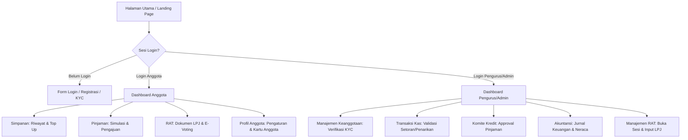
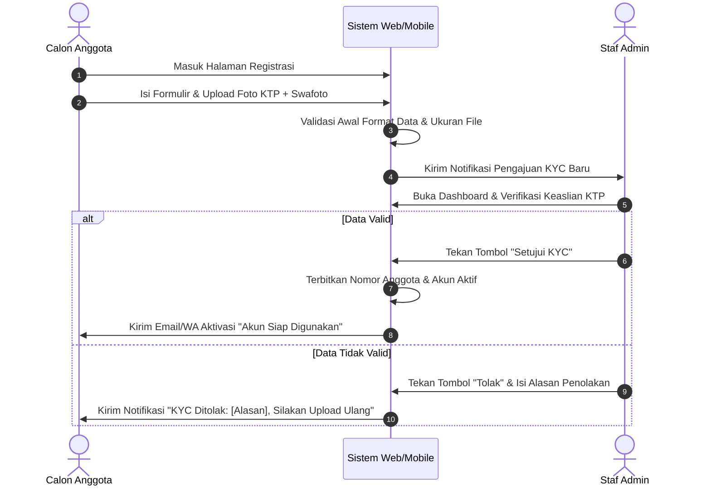
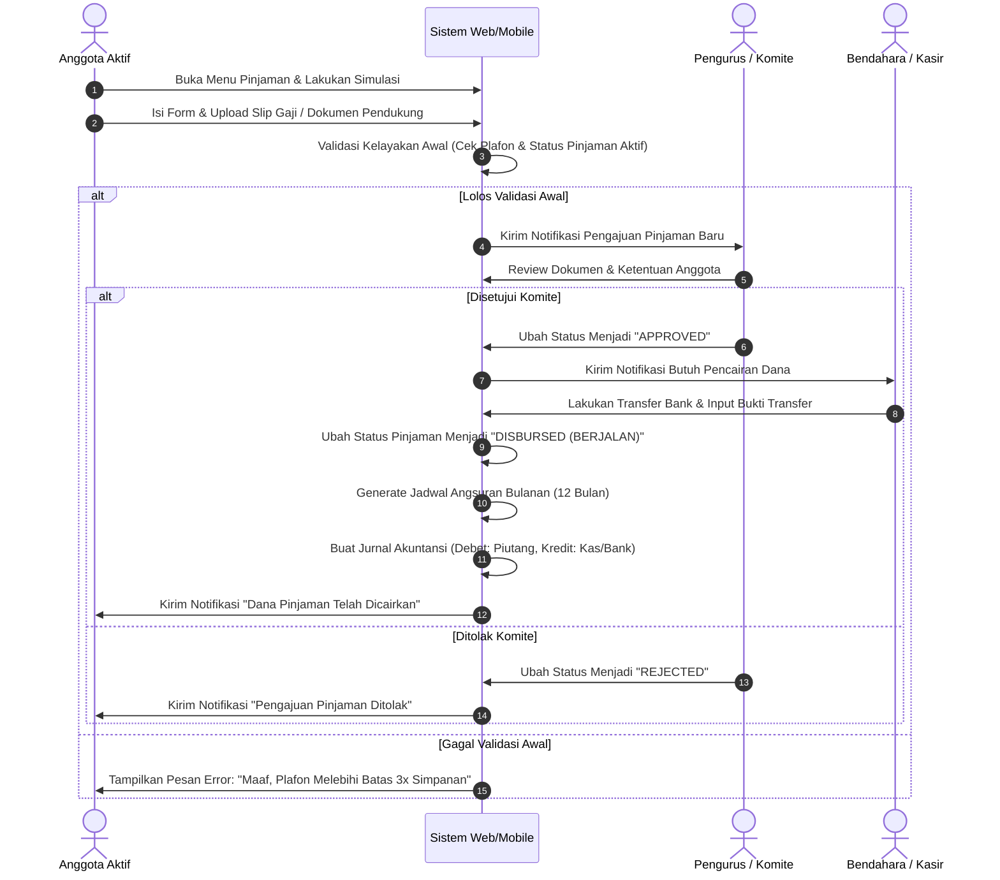

# Layout & Wireframe - Koperasi Digital

Dokumen ini mendeskripsikan tata letak (layout) antarmuka pengguna (UI) serta alur interaksi (user flow) untuk sistem **Koperasi Digital**. Antarmuka dirancang menggunakan pendekatan **Responsive Web Design**, di mana sisi anggota dioptimalkan untuk perangkat mobile (Mobile-First), sedangkan sisi admin/pengurus dioptimalkan untuk perangkat desktop.

---

## 1. Peta Navigasi Aplikasi (Sitemap)



---

## 2. Wireframe Antarmuka Utama

### 2.1 Dashboard Anggota (Mobile View - 360px width)
Halaman utama bagi anggota untuk melihat saldo simpanan, tagihan cicilan berjalan, dan menu aksi cepat.

```text
+--------------------------------------------+
|  [=] Koperasi Digital            [Notif]   |
+--------------------------------------------+
|  [X] Pasang aplikasi Koperasi?   [Pasang]  |
+--------------------------------------------+
|  Halo, Budi Santoso                        |
|  KOP-202606-0089 | ANGGOTA AKTIF           |
|                                            |
|  +--------------------------------------+  |
|  |  TOTAL SALDO SIMPANAN                |  |
|  |  Rp 4.750.000                        |  |
|  |                                      |  |
|  |  [ Pokok: 1M ] [ Wajib: 1.5M ] [ Sukarela: 2.25M ] |
|  +--------------------------------------+  |
|                                            |
|  Menu Layanan Cepat:                       |
|  +--------+   +--------+   +--------+      |
|  | [Simp] |   | [Pinj] |   | [RAT]  |      |
|  | Simpan |   | Pinjam |   | Voting |      |
|  +--------+   +--------+   +--------+      |
|                                            |
|  Tagihan Pinjaman Berjalan:                |
|  +--------------------------------------+  |
|  |  Cicilan Ke-3 dari 12                |  |
|  |  Jatuh Tempo: 05 Juli 2026           |  |
|  |  Jumlah: Rp 350.000                  |  |
|  |                                      |  |
|  |  [ BAYAR SEKARANG (QRIS/VA) ]        |  |
|  +--------------------------------------+  |
|                                            |
|  Riwayat Transaksi Terakhir:               |
|  * Simpanan Wajib Juni    [+] Rp 100.000   |
|  * Tarik Sukarela Tunai   [-] Rp 200.000   |
|  * Bayar Cicilan Ke-2     [-] Rp 350.000   |
|                                            |
+--------------------------------------------+
| [Home]     [Mutasi]     [Simulasi]   [Akun]|
+--------------------------------------------+
```

---

### 2.2 Dashboard Pengurus & Akuntansi (Desktop View)
Halaman khusus pengurus untuk mengelola operasional, menyetujui pinjaman, dan melihat grafik laporan keuangan real-time.

```text
+------------------------------------------------------------------------------------+
| KOP-DIGITAL (PENGURUS) | Dashboard  |  KYC  |  Pinjaman  |  Akuntansi  |  [Keluar] |
+------------------------------------------------------------------------------------+
|  Ringkasan Kinerja Koperasi                                                        |
|  +-------------------+  +-------------------+  +-------------------+               |
|  | Total Anggota     |  | Total Kas/Bank    |  | Total Piutang Aktif|              |
|  | 1,204 Orang       |  | Rp 154,800,000    |  | Rp 450,200,000    |              |
|  | [ +12 bln ini ]   |  | [ Likuiditas Aman]|  | [ NPL: 0.8% ]     |              |
|  +-------------------+  +-------------------+  +-------------------+               |
|                                                                                    |
|  Daftar Tugas Butuh Persetujuan Pengurus:                                           |
|  +-------------------------------------------------------------------------------+ |
|  | No  | Tanggal    | Kategori   | Pengaju      | Nilai          | Aksi          | |
|  |-----+------------+------------+--------------+----------------+---------------| |
|  | 1   | 30-06-2026 | Pinjaman   | Rina Susanti | Rp 5.000.000   | [Setuju] [X]  | |
|  | 2   | 30-06-2026 | KYC        | Joko Widodo  | NIK: 3273...   | [Review KYC]  | |
|  | 3   | 29-06-2026 | Tarik Kas  | Andi Wijaya  | Rp 1.500.000   | [Proses Cair] | |
|  +-------------------------------------------------------------------------------+ |
|                                                                                    |
|  Laporan Rugi Laba Berjalan (SHU Terkumpul): Rp 34,250,000                         |
|  ================================================================================= |
|  [ Grafik Perkembangan Simpanan vs Pinjaman Bulanan ]                              |
|                                                                                    |
+------------------------------------------------------------------------------------+
| (c) 2026 Koperasi Digital Indonesia - Hak Cipta Dilindungi                         |
+------------------------------------------------------------------------------------+
```

---

### 2.3 Form Pengajuan Pinjaman & Simulasi (Interactive Wizard)
Langkah-langkah terstruktur bagi anggota saat mengajukan pinjaman untuk meminimalkan kesalahan pengisian data.

```text
Langkah: [1. Simulasi] ---> 2. Pengisian Data ---> 3. Upload Dokumen ---> 4. Konfirmasi
+------------------------------------------------------------+
|  KALKULATOR PINJAMAN KOPERASI                              |
|                                                            |
|  Jumlah Pinjaman yang Diajukan (Rupiah):                   |
|  [ Rp 10.000.000                                        ]  |
|                                                            |
|  Tenor Pengembalian (Bulan):                               |
|  ( ) 3 Bulan    ( ) 6 Bulan    (*) 12 Bulan    ( ) 24 Bulan |
|                                                            |
|  Metode Perhitungan Bunga:                                 |
|  (*) Flat (1.0% per bulan)      ( ) Sliding (Menurun)      |
|                                                            |
|  Hasil Perhitungan Simulasi:                               |
|  * Pokok Pinjaman   : Rp  10.000.000                       |
|  * Bunga (12 bln)   : Rp   1.200.000                       |
|  * Total Kewajiban  : Rp  11.200.000                       |
|  * Cicilan Bulanan  : Rp     933.333 / bulan               |
|                                                            |
|  [ BATAL ]                               [ LANJUTKAN > ]   |
+------------------------------------------------------------+
```

---

## 3. Alur Pengguna (User Flow Diagram)

### 3.1 Alur Registrasi & KYC Anggota


### 3.2 Alur Pengajuan & Pencairan Pinjaman

