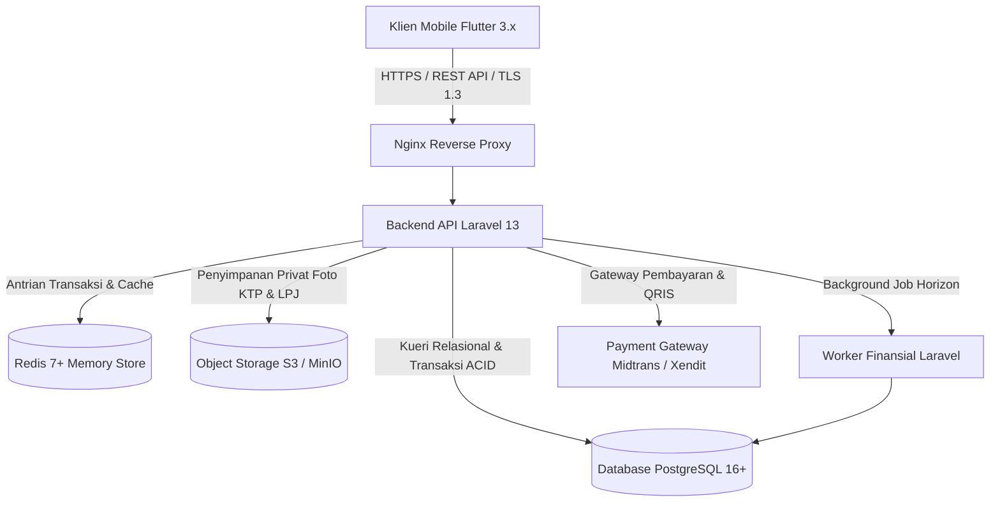

# Spesifikasi Tumpukan Teknologi (techstack.md)
## Sistem Koperasi Digital (*KopKar Digital*)

Dokumen ini merinci tumpukan teknologi (*technology stack*), pustaka pendukung (*libraries*), dan keputusan arsitektural yang digunakan dalam membangun platform Koperasi Digital.

---

## 1. Ringkasan Ekosistem Teknologi (*Tech Stack Summary*)



| Layer Arsitektur | Teknologi Terpilih | Versi | Alasan Pemilihan & Kegunaan |
| :--- | :--- | :--- | :--- |
| **Web Backoffice (Super Admin & Pengurus)** | **Laravel 13 Blade & Tailwind CSS** | **13.x** | Portal web khusus Super Admin dan pengurus untuk manajemen keanggotaan, verifikasi KYC KTP, approval pinjaman, pembukuan jurnal akuntansi, monitoring rasio, dan audit log. |
| **Mobile Client (Anggota Koperasi)** | **Flutter (Dart)** | **3.x (Dart 3.x)** | Satu basis kode (*single codebase*) untuk Android dan iOS khusus Anggota Koperasi (karyawan): transaksi simpanan, pengajuan pinjaman, belanja Kopmart, pembayaran QRIS, e-voting RAT, dan cek SHU. |
| **Backend REST API Core** | **Laravel** | **13.x** | API headless untuk mobile Flutter (token Sanctum), mesin kalkulasi bunga/SHU, validasi idempotensi, dan otorisasi transaksi. |
| **Bahasa Backend** | **PHP** | **8.3 / 8.4** | Mendukung *typed properties*, *readonly classes*, *first-class callables*, dan performa JIT yang cepat. |
| **Basis Data Relasional** | **PostgreSQL** | **16+** | Standar emas untuk sistem perbankan & finansial: kepatuhan ACID mutlak, presisi `DECIMAL(15,2)`, penguncian baris *pessimistic*, dan integritas *foreign key*. |
| **Cache & Queue** | **Redis** | **7.x** | Penyimpanan in-memory latensi sub-milidetik untuk *rate-limiting*, idempotency keys, dan antrian pencatatan buku besar akuntansi. |
| **Penyimpanan Berkas** | **MinIO / AWS S3** | S3-API | Penyimpanan objek terenkripsi privat untuk berkas KYC KTP, tanda tangan digital, dan dokumen LPJ RAT. |
| **Reverse Proxy** | **Nginx** | **Alpine** | Reverse proxy ringan, penanganan terminasi SSL/TLS 1.3, kompresi Brotli/Gzip, dan proteksi header keamanan. |
| **Kontainerisasi** | **Docker** | **26+** | Menjamin konsistensi lingkungan pengembangan (*development*) dan produksi (*production*). |

---

## 2. Dependensi Utama Backend (Laravel 13)

```json
{
  "require": {
    "php": "^8.3",
    "laravel/framework": "^13.0",
    "laravel/sanctum": "^4.0",
    "laravel/horizon": "^5.0",
    "spatie/laravel-permission": "^6.0",
    "ramsey/uuid": "^4.7",
    "barryvdh/laravel-dompdf": "^3.0",
    "maatwebsite/excel": "^4.0",
    "league/flysystem-aws-s3-v3": "^3.0",
    "predis/predis": "^2.0"
  },
  "require-dev": {
    "pestphp/pest": "^4.0",
    "pestphp/pest-plugin-laravel": "^4.0",
    "laravel/pint": "^1.16",
    "mockery/mockery": "^1.6"
  }
}
```

> **Catatan versi**: `maatwebsite/excel` dinaikkan ke `^4.0` (menggantikan `^3.1`) dan Pest dinaikkan ke `^4.0` (menggantikan `^3.0`) karena versi PHP lokal (8.5) tidak kompatibel dengan `phpoffice/phpspreadsheet` seri 1.x maupun `phpunit/phpunit` seri 11.x yang dipakai versi sebelumnya. `league/flysystem-aws-s3-v3` ditambahkan sebagai adapter wajib untuk disk `s3` (MinIO). `predis/predis` dipakai sebagai klien Redis murni-PHP karena ekstensi `phpredis` belum terpasang di lingkungan pengembangan lokal.

* **`laravel/sanctum`**: Otentikasi token ringan untuk API mobile.
* **`laravel/horizon`**: Dasbor pemantauan antrian transaksi finansial berbasis Redis.
* **`spatie/laravel-permission`**: Pengaturan RBAC (*Role-Based Access Control*) untuk Anggota, Bendahara, Ketua, dan Pengawas.
* **`barryvdh/laravel-dompdf`**: Mesin pencetak lembar rekening koran dan kuitansi pinjaman digital.
* **`pestphp/pest`**: Kerangka pengujian modern untuk kalkulasi bunga pinjaman dan jurnal penyeimbang.

---

## 3. Dependensi Utama Frontend Mobile (Flutter 3.x)

```yaml
dependencies:
  flutter:
    sdk: flutter
  
  # State Management & Events
  flutter_bloc: ^8.1.6
  equatable: ^2.0.5
  
  # Networking & HTTP
  dio: ^5.4.3
  
  # Routing
  go_router: ^14.1.4
  
  # Local Storage & Security
  flutter_secure_storage: ^9.2.2
  shared_preferences: ^2.2.3
  
  # UI, Icons & Formatting
  intl: ^0.19.0
  google_fonts: ^6.2.1
  flutter_svg: ^2.0.10
  mobile_scanner: ^5.1.1 # Pemindai QRIS
  shimmer: ^3.0.0        # Skeleton Loading
  cached_network_image: ^3.3.1
  fl_chart: ^0.68.0      # Grafik Real-Time E-Voting & Estimasi SHU

dev_dependencies:
  flutter_test:
    sdk: flutter
  bloc_test: ^9.1.7      # Testing BLoC & Cubits
  mocktail: ^1.0.4
  flutter_lints: ^4.0.0
```

---

## 4. Integrasi Pihak Ketiga (*Third-Party Integrations*)

1. **Payment Gateway & QRIS Nasional**:
   * Rekanan: **Midtrans / Xendit / Bank Partner**.
   * Protokol: Webhook asinkron bertanda tangan HMAC SHA-256 untuk mendeteksi keberhasilan pembayaran Virtual Account atau QRIS dinamis.
2. **Layanan Pesan Notifikasi (WhatsApp & Push Notification)**:
   * **Firebase Cloud Messaging (FCM)**: Pengiriman notifikasi pembaruan status pinjaman dan pengingat jatuh tempo ke perangkat Android/iOS.
   * **WhatsApp Business API**: Pengiriman kode OTP verifikasi registrasi dan kuitansi pembayaran resmi.
